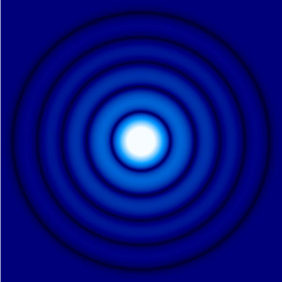

Hello! This is ZhengtongXie.It's a first try for me to use a website,in order to record my life.
 I will upload some notes and interesting things later!

 **Interests** 

- Symplectic Geometry
- Astronomy & Data process
- Photography

## Astronomy

## 有效点扩散函数（eSPF）

若有一个点光源，或者离我们特别远且小于一个像素的光源。当我们给它拍照片的时候，它将会扩散到周围的区域。为了量化这种扩散程度，我们可以定义一个函数。这就是点扩散函数的来源。

<!--  -->

 

<!--  -->
